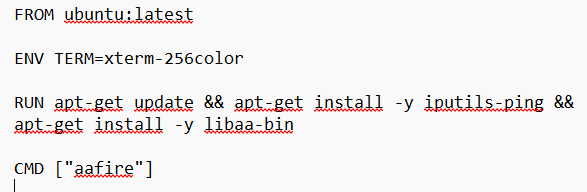
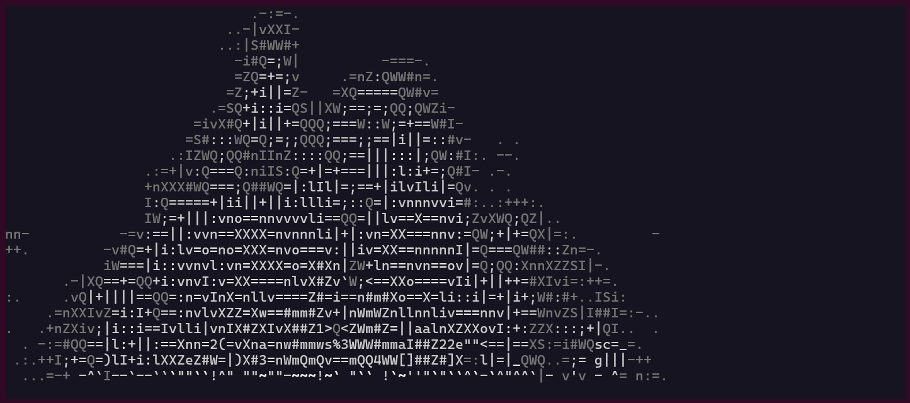
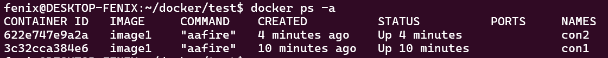
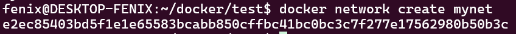
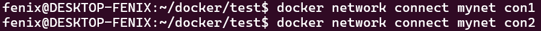
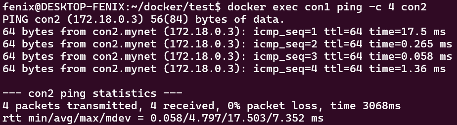
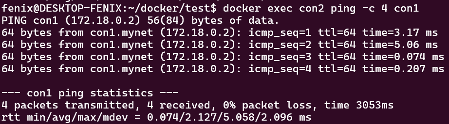

# Отчёт по лабораторной работе №4

Создадим Dockerfile для образа контейнеров


Построим образ
```bash
$ docker build -t image1 .
```

Запускаем контейнер при помощи команды:
```bash
$ docker run --rm --name con1 image1
```
Результат:


Запустим 2ой контейнер
```bash
$ docker run --rm --name con2 image1
```

Проверим, что они работают


Создадим сеть


Подключим контейнеры


Проверим подключение con1 к con2


Проверим подключение con2 con1
